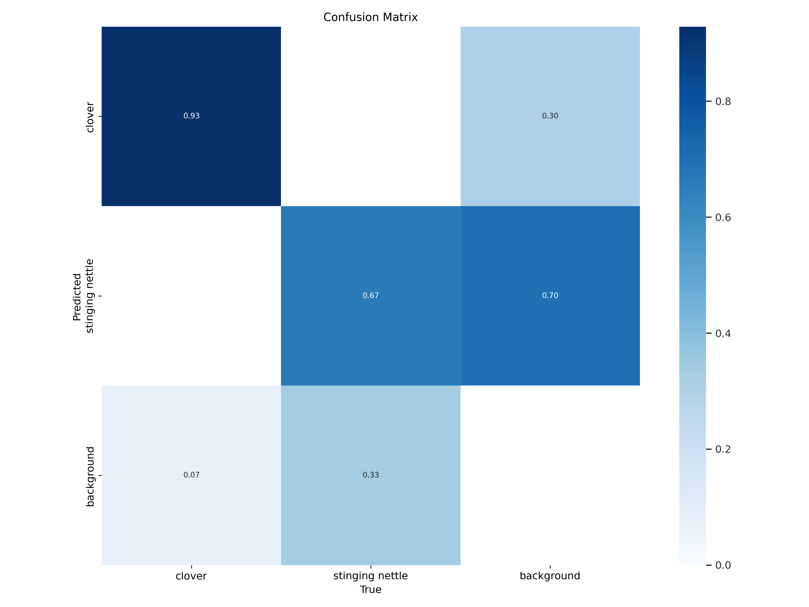

# Clover and Stinging Nettle Detection using YOLO

## Project Overview
This project implements deep learning-based object detection for identifying clovers and stinging nettles using both YOLOv5 and YOLOv8 architectures. The system is designed to provide accurate detection in various environmental conditions.

## Model Architecture
The project utilizes two YOLO versions:

### YOLOv5
- Base model: YOLOv5s
- Training configuration:
  - Image size: 640x640
  - Batch size: 8
  - Epochs: 200
  - Weights: Pre-trained on COCO dataset
  - Cache enabled for faster training

### YOLOv8
- Base model: YOLOv8n
- Training configuration:
  - Image size: 640x640
  - Batch size: 16
  - Epochs: 100
  - Optimizer: AdamW
  - Learning rate: 0.002
  - Momentum: 0.9

## Project Structure
```
project_root/
│
├── README.md
├── lover_stinging_nettle_detection.ipynb    # Main training notebook
├── data/
│   ├── train/                              # Training dataset
│   └── valid/                              # Validation dataset
└── models/                                 # Saved model weights
```

## Training Process
1. **Data Preparation**
   - Dataset is organized in YOLO format
   - Training and validation sets are split
   - Labels are prepared in YOLO format

2. **Model Training**
   - Both models are trained using Google Colab's GPU
   - Training progress is monitored using metrics:
     - Box loss
     - Classification loss
     - DFL loss
     - mAP50
     - mAP50-95

3. **Results Storage**
   - Best weights are automatically saved
   - Training logs and metrics are preserved
   - Models are exported to Google Drive for persistence

## Performance Metrics
YOLOv8 Final Results (after 100 epochs):
- Box Precision: 0.909
- Recall: 0.885
- mAP50: 0.942
- mAP50-95: 0.685

## Experimental Results

### YOLOv5 Experiments




### YOLOv8 Experiments


### Prediction Examples
#### YOLOv5 Predictions


#### YOLOv8 Predictions


## Usage Instructions 

## Usage Instructions
1. Open the notebook in Google Colab
2. Mount your Google Drive
3. Upload your dataset
4. Run the cells sequentially
5. Monitor training progress
6. Retrieve saved models from the specified Drive location

## Requirements
- Google Colab environment
- GPU runtime
- Python 3.10+
- PyTorch
- Ultralytics YOLOv5 and YOLOv8
- Google Drive storage

## Future Improvements
- Implement ensemble methods
- Add data augmentation techniques
- Optimize model parameters
- Add real-time detection capabilities
- Expand dataset with more varieties

## License
This project is licensed under the MIT License.

## Contact
